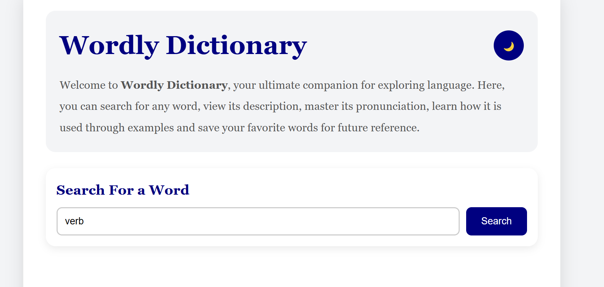
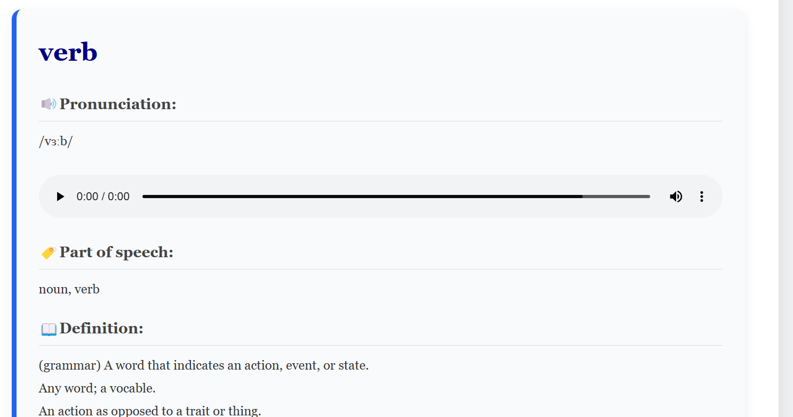
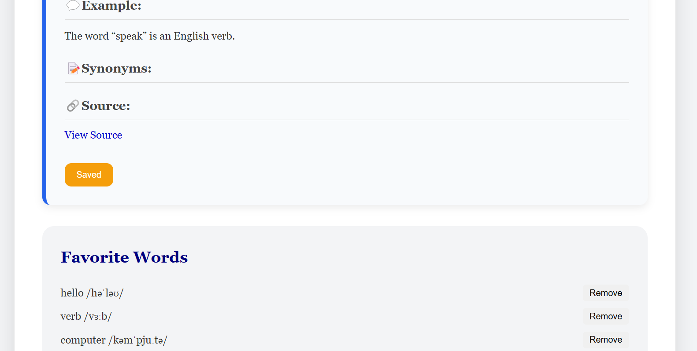

# Wordly Dictionary SPA

## About 
Wordly Dictionary SPA is a **Single Page Application (SPA)** that allows users to search for English words and instantly view their meanings, pronunciations,audio pronunciation, examples, synonyms and source information. The application uses the **Free Dictionary API** to reveal real-time dictionary data without refreshing the page.

## Features
- Search for English words.
- View Definitions
- Display parts of speech
- Listen to pronunciation audio(when available)
- View pronunciation text
- Display example sentences
- View synonyms
- Save favorite words using **localStorage**
- Remove saved favorites
- Click a favorite word to search for it again
- Light/Dark theme toggle
- Error Handling
- Responsive design for desktop and mobile devices

## Technologies Used
- HTML
- CSS
- JavaScript
- Free Dictionary API
- Local Storage

## Project Structure

```text
├── index.html
├── css/
│   └── style.css
├── js/
│   └── index.js
├── assets/
│   ├── wordlyscreenshot1.png
│   ├── wordlyscreenshot2.png
│   └── wordlyscreenshot3.png
└── README.md
```

## How to run the project
1. Clone the repository
```bash
git clone git@github.com:modidi/dictionary-app.git
```

or download the ZIP file

2. Open the project folder 

3. Open **index.html** in your browser

OR 

Open the project using **Live Server** in Visual Studio Code.

4. Enter an English word in the search box.

5. Click **Search**.

## API Information

This project uses the **Free Dictionary API**.

Endpoint format: ```
https://api.dictionaryapi.dev/api/v2/entries/en/{word}
```
The API provides:
- Definitions
- Parts of speech
- Pronunciation text
- Audio pronunciation
- Example sentences
- Synonyms
- Source links
```

## Usage
1. Enter a word
2. Click **Search**
3. View the returned dictionary information.
4. Play Pronunciation audio if available.
5. Save the word as a favorite.
6. Remove saved favorites whenever needed.
7. Toggle between Light and Dark Mode.

## Screenshots






## Live Demo
```
https://modidi.github.io/dictionary-app/
```

---

## GitHub Repository
```
https://github.com/modidi/dictionary-app
```

---

## Known Limitation
- Some words may not have pronunciation audio.
- Some words may not include example sentences.
- Some words may not contain synonyms.
- The application currently supports **English words only** because of the API.

## Author
**Maureen Mutua**

Github:
```
https://github.com/modidi
```

---

## License 
This project was created for educational purposes.


